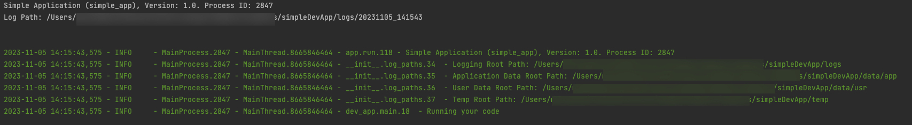

# dtPyAppFramework

[](https://opensource.org/licenses/MIT)

**dtPyAppFramework** is a Python library designed to streamline the development of Python applications by providing common features and abstractions. It promotes good practices, modular design, and ease of use.

## Features

- **Singleton Management:** Simplify the use of singleton classes by automating initialisation with predefined parameters.
- **Settings and Configuration:** Manage application settings and configurations effortlessly.
- **Secrets Management:** Securely handle secrets and credentials using local or cloud-based stores like AWS Secrets Manager and Asure KeyVault.
- **Application Initialisation:** Quickly initialise your Python applications with the `AbstractApp` class, which takes care of common initialisation tasks.
- **Process Management:** Use the `ProcessManager` for efficient process handling in your applications.

## Installation

```bash
pip install dtPyAppFramework
```

## Getting Started
### AbstractApp Class ###
The **`AbstractApp`** class serves as a base class for creating Python applications. It handles common initialisation tasks and provides a structure for defining command-line arguments and the main application logic.


To create a simple Python application using dtPyAppFramework:
```python
from dtPyAppFramework.app import AbstractApp
from dtPyAppFramework import settings

import logging

class MyApplication(AbstractApp):

    def define_args(self, arg_parser):
        # Define your command-line arguments here
        return

    def main(self, args):
        logging.info("Running your code")
        ## Place you own code here that you wish to run
        
# Initialise and run the application
MyApplication(description="Simple App", version="1.0", short_name="simple_app",
          full_name="Simple Application", console_app=True).run()
```

The above example will output the following to the console:



## Features
Now lets take some time to go over the various features that makes `dtPyAppFramework` such a power library to base your 
Python projects of.

### Logging
`dtPyAppFramework` offers flexible logging capabilities, allowing you to configure and manage logs easily. <br>
In addition it offers some pretty cool logging capabilities straight out of the door which requires no setup from you.

[More about logging](Logging.md)

### Configuration Files
Easily read and manage configuration settings from configurations files.<br>
Configuration files can be set for a specific user or for any user of the application.

[More about configuration files](Configuration_Files.md)

### Secrets Management
Securely store and retrieve sensitive information with encryption and best practices.<br>
You can store secrets for a specific user or make secrets available to all users of the application.<br>
In addition, you can use the AWS Secrets Management seamlessly within the application alongside the in-built secrets store.

[More about secrets management](Secrets_Management.md)

### Command Line Arguments
Effortlessly parse and manage command line arguments with support for defining options and accessing them in your code.

[More about command line arguments](Command_Line_Arguments.md)

### Application Directories
Access common resource paths like user storage directories.

[More about resource paths](Application_Directories.md)

### Resource Manager
A robust Resource Manager, which is a singleton class named `ResourceManager`.

[More about resource paths](Resource_Manager.md)

## License

This project is licensed under the [MIT License](https://opensource.org/licenses/MIT).

## Contact

If you have any questions, bug reports, or feature requests, feel free to [contact us](mailto:dev@digital-thought.org).