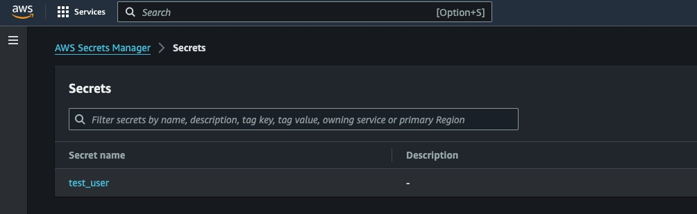
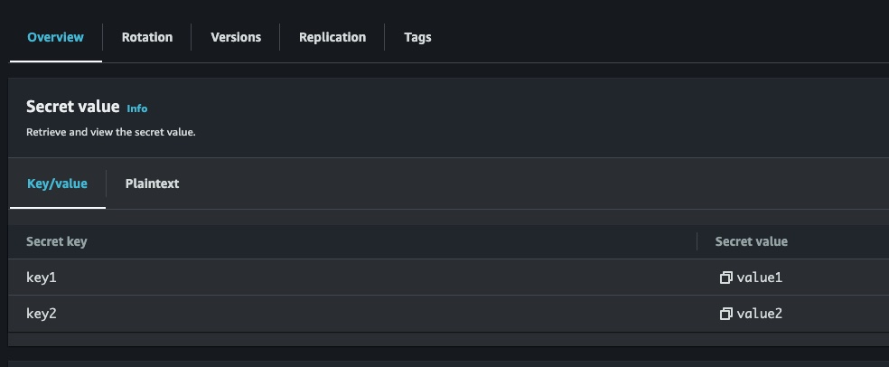

Accessing Secrets in AWS Secrets Manager
=======================

The following provides an example of accessing a secrets value from an AWS Secrets Manager.

For the purpose of this example, we have created a sample "Secrets" in AWS, Secrets Manager:

This secret has been setup as a 'Key/value' pair:

Define the AWS Secrets Manager within the `config.yaml` file
----------------------------------

The first thing you need to do is to define the connection to the target "Secrets" instance within the AWS Secrets Manager.

In this example we will be using `aws_access_key_id` and `aws_secret_access_key` to access the secrets manager.

.. code-block:: yaml

   secrets_manager:
     cloud_stores:

         test1:
           store_type: aws
           priority: 100
           aws_profile: key
           aws_region: ap-southeast-2
           aws_access_key_id: <SECRET_KEY_ID>
           aws_secret_access_key: <SECRET_ACCESS_KEY>
           secret_name: test_user

Example Code
----------------------------------

.. code-block:: python

   from dtPyAppFramework.application import AbstractApp
   from dtPyAppFramework import settings

   import logging

   class MyApplication(AbstractApp):

       def define_args(self, arg_parser):
           # Define your command-line arguments here
           return

       def main(self, args):
           logging.info("Running your code")
           logging.info(f'All Key/Value Pairs in the Secret for cloud store "test1" : {settings.Settings()['test1']}')
           logging.info(f'Just the value for "key1" in the Secret for cloud store "test1" : {settings.Settings()['test1.key1']}')

   # Initialise and run the application
   MyApplication(description="Simple App", version="1.0", short_name="simple_app",
             full_name="Simple Application", console_app=True).run()

The above example will output the following to the console:

.. code-block:: console

    All Key/Value Pairs in the Secret for cloud store "test1" : {'key1': 'value1', 'key2': 'value2'}
    Just the value for "key1" in the Secret for cloud store "test1" : value1

By using the name of the cloud store you defined in the `config.yaml` when retrieving a setting, you can instruct the settings to retrieve the value from the defined cloud secrets store.

In the above example, if we simply specify the name of the cloud store `test1`, it returns the entry contents of the secret (the dict if a key/value store or the plaintext if defined as a plaintext).
By using a key/value store and specifying the specific required key name after the cloud store name (e.g. `test1.key1`), I can retrieve just the value associated with the key `key1`.